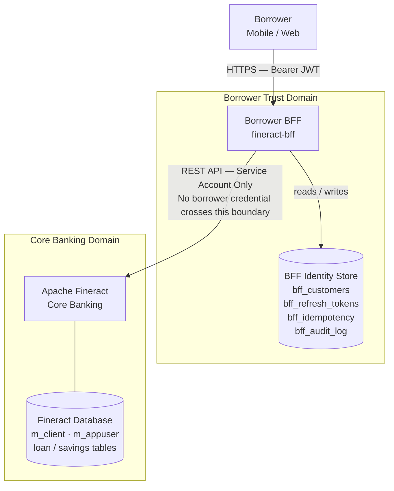
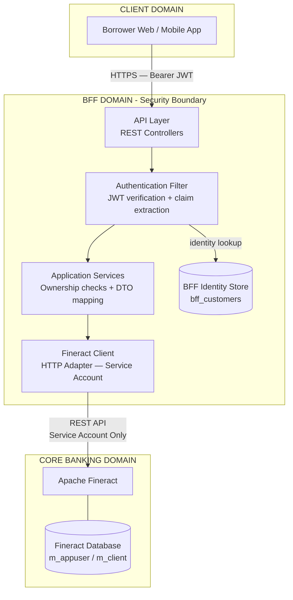
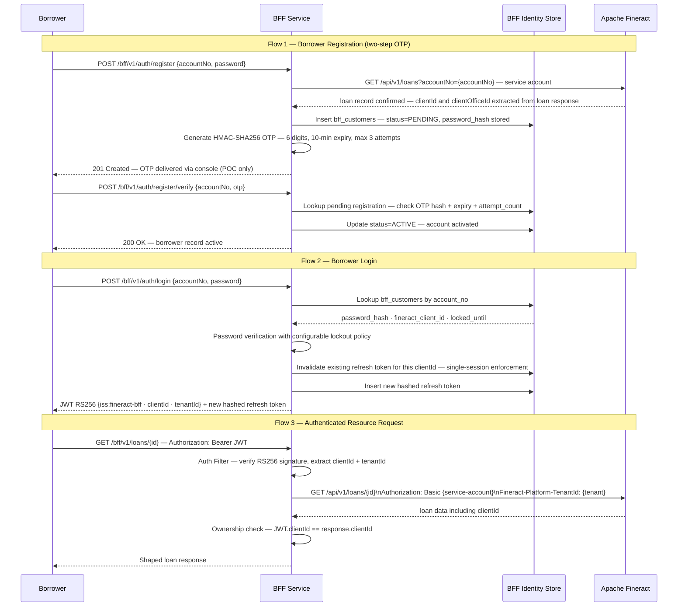
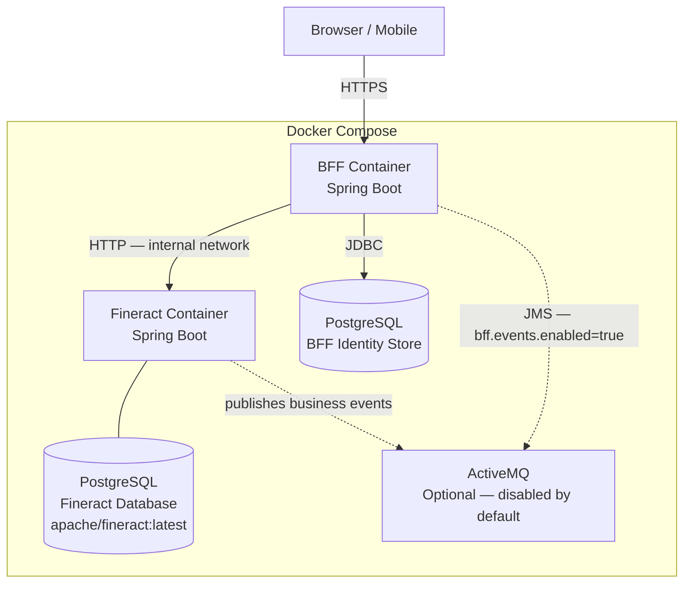

# FINERACT-2439 — Borrower Backend-for-Frontend (BFF)
## Architecture Outline

**Author:** Ashhar Ahmad Khan  
**GitHub:** https://github.com/AshharAhmadKhan  
**Issue:** FINERACT-2439  
**Date:** March 2026  

---

## 1. Overview

The self-service module was disabled in 2025 after living roughly a decade
in the codebase. Analysis showed seven OWASP-class vulnerabilities and they all came from the same place. Borrower-facing access control had been built
inside a back-office security model. That is not something you patch. It
was a wrong architectural decision from day one and this is why the community
decided to do the cleanup work. I volunteered to actually do it in PR #5498, which was merged into apache/fineract develop in March 2026, removing the module entirely.

The BFF is a standalone Spring Boot service. It owns borrower identity
independently of Fineract's m_appuser model. Fineract's permission chain
runs through m_appuser and it was built for staff workflows. Borrowers have
no place in it. Plugging them into that chain is exactly what caused the
old module to fail, so I kept borrowers completely out of it.

Two things I kept in mind throughout: no borrower credential will ever reach
Fineract, and no back-office credential will ever reach the borrower.
Fineract itself needs no modifications.

This is the trust boundary between borrowers and Fineract that should have
existed from the start.

---

## 2. Problem Context

None of these were bugs you could just patch and move on. I went through
each of them individually and even though they all pointed back to the same
root cause, I still went through them one by one to make sure I had a real
fix for each of them and not just a general solution. The table below maps
each failure to what the BFF does differently.

| Vulnerability | OWASP | Architectural Fix |
|---|---|---|
| Authorization bypass via URL path heuristic | A01 | JWT ownership check on every endpoint — clientId verified before any data is returned |
| Tenant boundary violation | A01 | BFF Identity Store physically separate from m_appuser — no shared tables |
| Plain-text device token storage | A02 | Hashed refresh tokens with server-side rotation |
| Unvalidated OTP registration | A07 | HMAC OTP with attempt limit and expiry |
| Concurrent transfer race condition | A04 | Idempotency interceptor at the HTTP boundary — key is SHA-256(clientId + loanId + amount + business date), all server-controlled inputs. Duplicate never reaches service layer |
| Zero audit logging | A09 | BffAuditInterceptor fires on every request including unauthenticated failures |
| Command injection via borrower input | A03 | `command=repayment` hardcoded in BFF — borrower cannot supply or influence the Fineract command parameter |

---

## 3. System Context

The BFF acts as the boundary between borrower-facing client applications
and the Fineract core banking platform. Client applications never interact
with Fineract directly. The BFF is the only place where all borrower
operations go through and nothing reaches Fineract except through here.

The two stores are physically separate. No foreign key or shared table
exists between them. The only link between the two domains is the service
account connection, a single auditable path with the least privileges
necessary and nothing more.

---

## 4. Domain Architecture

I divided the system into three responsibility domains. The BFF domain is
where all security and integration happens and nothing gets through without
going through it first.

Ownership enforcement at the BFF layer compensates for the absence of ABAC in Fineract — a borrower can only access their own resources, enforced by verifying JWT claims against Fineract's response on every request.

Authentication is not optional for any endpoint that touches borrower data.
You do not get to the business logic without a valid JWT. The Authentication Filter sits
between the API layer and the application services for exactly this reason.
The four unauthenticated endpoints — register, register/verify, login, refresh —
are passed through by the filter without JWT validation. They have no borrower
identity to verify at that point. Every other endpoint is blocked without a valid JWT.
Identity claims travel from the token into every downstream call. Fineract
never sees a borrower credential.

---

## 5. Authentication Sequences

Three flows cover everything a borrower can do. In all three the service
account credential is completely invisible to the borrower. They never see
it, they never touch it.

The ownership check in flow 3 runs before anything is returned. If the JWT
clientId does not match what Fineract returns, the borrower gets a 403 and
sees nothing. There is no way to guess another borrower's loan ID and get
data back.

The OTP in flow 1 is generated server-side using HMAC. The plain value is
never saved anywhere. Only the hash is stored and verification just compares
hashes. The attempt count does not reset. A second registration attempt against
the same accountNo while a PENDING record exists is rejected — no new OTP
is issued and no new attempt counter is created. Exhausting three attempts
is a hard stop. The one exception is expiry: if the existing PENDING record's
OTP window has elapsed, a new registration attempt replaces it with a fresh
record and a new OTP. The attempt counter resets only in this case.

---

## 6. API Boundary

I kept the API surface small on purpose. Ten endpoints across five domains: auth, accounts, loans, savings, and transfers.
The MVP is registration, login and loan repayment and those are marked in
the table. Everything else is Phase 2 and is a stretch goal conditional on
MVP completion. The OpenAPI spec at `/bff/v1/openapi.yaml` is the contract for
anyone building on top of this.

| Method | Path | Auth | MVP | Description |
|---|---|---|---|---|
| POST | /bff/v1/auth/register | No | ✓ | Register borrower — OTP two-step flow |
| POST | /bff/v1/auth/register/verify | No | ✓ | Verify OTP → activate account |
| POST | /bff/v1/auth/login | No | ✓ | Issue JWT pair |
| POST | /bff/v1/auth/refresh | No | ✓ | Rotate refresh token |
| POST | /bff/v1/auth/logout | JWT | ✓ | Invalidate refresh token — single-session enforcement |
| GET | /bff/v1/accounts | JWT | ✓ | Dashboard — all accounts |
| GET | /bff/v1/loans/{id} | JWT | ✓ | Loan detail + repayment schedule |
| GET | /bff/v1/savings/{id}/transactions | JWT | | Savings transactions paginated |
| POST | /bff/v1/loans/{id}/repayment | JWT | ✓ | Make repayment — idempotent |
| POST | /bff/v1/transfers | JWT | | Same-client savings transfer |
| POST | /bff/v1/loans/apply | JWT | | Loan application submission — clientId and officeId sourced from JWT claims |

The repayment command is hardcoded inside the BFF. The borrower cannot
touch the Fineract `command` parameter at all. This was not an accident.
There is an injection vector in the Fineract codebase where a borrower
could influence that parameter and trigger a loan write-off. That is
closed here.

Logout kills the refresh token server-side immediately. One active refresh
token per borrower, that is it. A new login wipes the previous session.
So if a borrower loses their device, logging in from a new one immediately
shuts down whatever was active before. That is the SIM-swap protection
built in.

---

## 7. Deployment Architecture

The BFF deploys as a single container sitting alongside Fineract. Nothing
extra is needed for the core POC. The event bridge exists but it is off by
default and the whole thing works fine without it.

The BFF Identity Store runs on PostgreSQL. The Docker Compose setup uses
`apache/fineract:latest`, which runs on PostgreSQL. The Fineract source
currently supports both MariaDB and PostgreSQL; the Docker image reflects
the current runtime configuration.

These are completely separate containers with no shared credentials between
them, which is intentional. Schema migrations run automatically through
Flyway on startup so there is no manual schema work needed.

The service account gets provisioned manually before first startup using
the Fineract admin API. I kept the permissions as tight as possible. The
full list, verified from the Fineract source, is as follows:

- `READ_LOAN` — read loan accounts and repayment schedules
- `READ_CLIENT` — read borrower client records
- `READ_SAVINGSACCOUNT` — read savings accounts
- `REPAYMENT_LOAN` — submit repayment transactions

If the loan application stretch goal is implemented, the service account scope will be extended to include `CREATE_LOAN` permissions at that point.

The registration flow performs a single Fineract call: `GET /api/v1/loans?accountNo={accountNo}`.
The loan response includes both clientId and clientOfficeId directly — confirmed from the
Fineract source. Both are stored in `bff_customers` at registration so transfer payloads
use the borrower's actual office rather than a hardcoded default.

---

## 8. Operational Considerations

I did not want this service to fail silently. That was the starting point
for every decision in this section.

- **Startup health check** — on startup the BFF fires
  `GET /api/v1/clients?limit=1` against Fineract. If it does not get back
  HTTP 200 the service refuses to start. It fails loud or it does not
  run at all.
- **SSL configuration** — Fineract runs on port 8443 with a self-signed
  certificate in local POC deployments. SSL verification is disabled for
  local development via SSLContext with NoopHostnameVerifier, controlled
  by an environment variable. SSL verification is enabled by default.
  Any non-local deployment must leave the default in place.
- **Rate limiting** — register, verify and login are protected with Bucket4j
  keyed by IP address and account number. This covers credential stuffing
  and brute-force without needing Redis for the POC.
- Health checks via Spring Boot Actuator (`/actuator/health`)
- Structured logging with `X-Request-Id` for tracing requests across the
  BFF and Fineract together
- Metrics via Micrometer
- Audit trail via `BffAuditInterceptor` — fires on every request including
  ones that never authenticate, capturing borrower ID, endpoint, status
  code, IP address and duration. If something goes wrong there is a full
  record of it.

---

## 9. Design Decisions

**Separate repository — apache/fineract-bff**  
Putting the BFF inside the apache/fineract monorepo would tie its release
cycle to Fineract's and pull in a CI build that takes forever. A standalone
repository keeps things independent. That is how other distinct Fineract
components are handled and this should be no different.

**RS256 JWT over HS256**  
HS256 means sharing the signing secret with every consumer and that is just
asking for trouble. RS256 means any frontend can verify tokens using the
public key without ever seeing the secret. The private key stays in BFF
environment configuration and never leaves. Issuer is `fineract-bff`. These
tokens are never presented to Fineract.

**Flyway over Liquibase**  
Fineract used Flyway until 1.6.x and only switched to Liquibase in 1.7.0
when the schema got big enough to need it. The BFF has a small schema and
I did not find any reason to bring Liquibase in here.

**WireMock over Testcontainers for integration tests**  
Testcontainers needs a live Fineract instance in CI. Long startup, fragile
dependencies, slow feedback. WireMock stubs the Fineract boundary in
milliseconds. The tests cover BFF behaviour and that is all that matters
here.

**In-memory Bucket4j over Redis for rate limiting**  
Redis adds another container for a single-instance POC. The Bucket4j API
works the same whether backed by memory or Redis so upgrading later is just
a config change. State resets on restart and that is a known tradeoff, not
a design flaw.

---

## 10. Non-Goals

I want to be clear that none of these are oversights.

- **Fineract core modifications** — the BFF talks to Fineract as an
  external client. Nothing in the Fineract source code needs to change.
- **ABAC implementation** — the external user database pattern is the right
  boundary for now. When Fineract adds attribute-based access control
  alongside its existing RBAC model that conversation can happen.
- **Multi-tenant routing** — single tenant via environment variable for the
  POC. `tenantId` is already in the JWT claims so Phase 2 routing does not
  need a token format change.
- **Production-grade UI** — the reference borrower client is a validation
  mechanism, not a deployable product. Its purpose is to prove the BFF API
  surface is usable and correctly enforced end-to-end. Visual polish is
  explicitly out of scope.
- **Event streaming as a core dependency** — the event bridge is off by
  default. The POC works completely without it.
- **Full microservice decomposition** — Fineract-CN tried this with around
  30 microservices and was retired in 2023. The BFF adds one service and
  one integration point and that is enough.
- **Horizontal scaling and distributed rate limiting** — Redis-backed
  Bucket4j and multi-instance deployment are Phase 2.

---

## 11. Technology Stack

| Component | Technology | Rationale |
|---|---|---|
| BFF Framework | Spring Boot — Java 21 | Same framework as Fineract — zero contributor switching cost |
| Authentication | JWT RS256 | Asymmetric — public key shareable with downstream consumers |
| Fineract Integration | Spring RestTemplate + Apache HttpClient 5 | Dedicated HTTP adapter — all Fineract calls encapsulated behind a single interface |
| BFF Identity Store | PostgreSQL 15 | Aligns with Fineract's PostgreSQL CI pipeline |
| Schema Migrations | Flyway | SQL-first, independent of Fineract's Liquibase chain |
| Rate Limiting | Bucket4j — in-memory | Redis-identical API — trivial Phase 2 upgrade path |
| Testing | JUnit 5 + Mockito + WireMock | Deterministic CI without a live Fineract dependency |
| CI Pipeline | GitHub Actions | Build + test + Checkstyle + SpotBugs + Apache RAT |
| Containerisation | Docker Compose | Single-command local setup for contributors |
| Event Bridge (optional) | ActiveMQ Classic + Avro | Off by default — borrower notification store-and-forward; `bff.events.enabled=true` to activate |

---

*I will finalise the database schema, interceptor specs and test suite with
the mentor during community bonding. I have a clear picture of where things
are going but I would rather work out the details with someone who knows the
codebase than lock something in on paper that ends up needing to change.*
